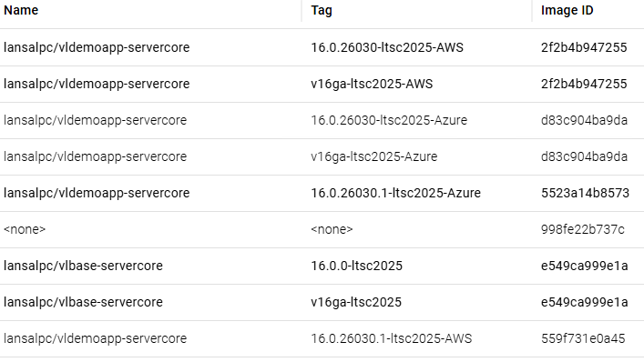

# LANSA Docker Image Creation and Usage Instructions

## 1. Overview
The code is in the GitHub Repository: git@github.com:robe070/cookbooks.git (sub-directory: Docker). Branch: debug/paas.

I have published a Visual LANSA runtime base image to Docker Hub. The AWAMAPP example image is not published. The base image includes only the prerequisites to install and run LANSA.
**lansalpc/vlbase-servercore**
**Tags**
16.0.0-ltsc2025 (Immutable)
v16ga-ltsc2025 (Floating)
15.0.0-ltsc2025 (Immutable)
v15ga-ltsc2025 (Floating)

This image is essentially the same as the images we publish in AWS and Azure Marketplace. To run a Visual LANSA app you need to deploy a VL MSI into the image.

All the code to assemble the base image and to deploy a VL MSI into the image and construct an image of that is published here: https://github.com/robe070/cookbooks/tree/debug/paas/Docker

The AWAMAPP example demonstrates installing a LANSA MSI into the base container.

Database state is integral to the MSI installation. The resulting image and database must match.

IMAGE-NAMING.md describes the image naming structure.
LANSA Docker Image creation and Usage Instructions.md is the user guide. (This file)

You will need to install Hot Fix EPC160000HF_260417 for V16 and Hot Fix ****** for V15 and construct an MSI to deploy into the Docker image. These Hot Fixes enable Cloud Account Id licensing in a Docker image for both AWS and Azure. I have tested both. Scripts in the above github repo require a Cloud type to be supplied when constructing the application image.

Infrastructure creation like load balancers has not been provided.

N.B. Docker Host must match the image pretty closely. You will need the latest version of Windows Server 2025. This is a Windows on Docker restriction. Nothing to do with LANSA.

It also means that constructing a Visual LANSA base image for another version of Windows requires setting up a new VM running that version.

## 2. Licensing
Obtain a Cloud Account Id license for either AWS or Azure, add it to the x_lic*.lic file using the "Licensing - Server Licenses" application int the development environment Settings & Administration folder and place the x_lic*.lic file in the application root directory (e.g. AWAMAPP). Multiple license files may be added so that the Docker image you create may be used in both your AWS and Azure accounts, and also support multiple accounts and multiple regions if thats necessary.

The license files are copied into the LANSA licensing directory during installation.

Instructions for obtaining the Cloud Account Id license:
https://docs.lansa.com/16/en/lansa041/content/lansa/l4winsba_0055.htm

## 3. Images and Tags
Base image repository: lansalpc/vlbase-servercore

AWAMAPP image repository: lansalpc/vldemoapp-servercore

Floating label tags (example: v16ga-ltsc2025) are for ease of customer testing.

Use immutable tags for production (example: 16.0.26030-ltsc2025).

## 4. Construction Flow
### 4.1 run.ps1
Creates the install container (LANSA-APP) and runs init.ps1 to install the MSI into the base image.

Key inputs: -DockerLabel, -VersionNum, -VersionLabel, -SQLHost (optional), -SQLPort (optional), -Trace (optional), -Cloud (required).

Before `init.ps1` is invoked, `run.ps1` copies the top-level `*.*` files from `iis\AWAMAPP` into the container root directory `C:\`. Files matched by `iis\AWAMAPP\.dockerignore` are skipped. This provides Dockerfile-like override behavior without rebuilding the base image.

`run.ps1` passes selected host environment variables through to the container based on `-Cloud`.

When `-Cloud Azure`, these host environment variables must exist:
- `AZURE_TENANT_ID`
- `AZURE_CLIENT_ID`
- `AZURE_CLIENT_SECRET`
- `AZURE_LOCATION`

When `-Cloud AWS`, these host environment variables must exist:
- `AWS_ACCESS_KEY_ID`
- `AWS_SECRET_ACCESS_KEY`
- `AWS_DEFAULT_REGION`

When `-Cloud AWS`, `AWS_SESSION_TOKEN` is also passed through if it exists on the host.

`run.ps1` remains attached because `init.ps1` ends by tailing the IIS log in the PowerShell window. Once you have tested that the application is running and has been deployed successfully, type `Ctrl-C` to end that PowerShell window. This stops the container so the image can then be committed.

The provided scripts expose the container's port 80 as port 50080. Therefore an example url to execute a WAM is http://localhost:50080/cgi-bin/lansaweb?wam=DEPTABWA&webrtn=BuildFirst&ml=LANSA:XHTML&part=DEX&lang=ENG

### 4.2 commit.ps1
Stops `LANSA-APP` with an extended timeout and then commits it as a new image, replacing the entrypoint with `C:\bootstrap.ps1`.

Do not restart a stopped `LANSA-APP` container. Until commit time its configured startup still runs `init.ps1`, so starting it again reruns the install flow.

### 4.3 Patching
If an additional DLL must be added after the MSI install, there are two supported approaches. And you should consider re-building the MSI and then re-building the application Docker image.

Quick one-off test:
- Run `.\run.ps1` first so the install container `LANSA-APP` exists and the repository is mounted as `C:\docker`.
- To inspect the running container with a PowerShell command prompt:
```
docker exec -it LANSA-APP powershell -NoLogo
```
- To copy `X_PDFMS.DLL` into the running container before commit:
```
docker exec LANSA-APP powershell -NoLogo -NoProfile -Command "Copy-Item 'C:\docker\iis\AWAMAPP\Patch\X_PDFMS.DLL' 'C:\Program Files (x86)\Docker\X_Win95\X_Lansa\Execute\X_Pdfms.dll' -Force"
```
- After validation, run `.\commit.ps1` to capture the patched container as an image.

Repeatable patch image:
- Complete the normal `.\run.ps1` and `.\commit.ps1` flow first to create the parent image.
- Place `X_PDFMS.DLL` in `iis\AWAMAPP\Patch`.
- Build a child image from `iis\AWAMAPP\Patch\build.ps1`.
- This is the preferred option when the patch needs to be reproducible. The default patched image tag is `lansalpc/vldemoapp-servercore:16.0.26030.1-ltsc2025`.
- Its a very fast process so it may as well be used every time you need to patch.

### 4.4 run_img.ps1
Runs the committed image for test/validation.

Key inputs: -DockerLabel, -VersionNum, -SQLHost (optional), -SQLPort (optional), -SQLDsn (optional), -Trace (optional), -ByPassSQLServerDNSChecks (optional).

run_img.ps1 can be run without database parameters if the database server has not changed. In that case, pass -ByPassSQLServerDNSChecks so bootstrap.ps1 skips DNS and ODBC validation. But note that stopping a Cloud VM and restarting it may change the VM IP Address and if your database is on the container host the ODBC DSN needs to be modified. run_img.ps1 obtains the current IP address and passes it to bootstrap.ps1 to modify the ODBC DSN. It also is quite quick, so its recommended to always run without -ByPassSQLServerDNSChecks.

## 5. Installation Examples
### 5.1 SQL Server Instance on the Host
This uses the host NAT address by default and port 1433.

Command:
```
.\run.ps1 -DockerLabel ltsc2025 -VersionNum 16.0.0 -VersionLabel "V16 GA" -Cloud Azure
```

### 5.2 SQL Server on the Network (DNS Name)
Provide a stable DNS name and port.

Command:
```
.\run.ps1 -DockerLabel ltsc2025 -VersionNum 16.0.0 -VersionLabel "V16 GA" -SQLHost sql01.corp.local -SQLPort 1433 -Cloud Azure
```

### 5.3 Commit the Installed App Image
Use this after `.\run.ps1` has completed validation and `LANSA-APP` has been stopped. The numeric tag matches the image tag used by `.\run_img.ps1`.

Command:
```
.\commit.ps1 -DockerLabel ltsc2025 -VersionNum 16.0.26030
```

### 5.4 Run Final App Image with Database Overrides
These overrides are applied at runtime by C:\bootstrap.ps1.

Command:
```
.\run_img.ps1 -DockerLabel ltsc2025 -VersionNum 16.0.26030 -SQLHost sql01.corp.local -SQLPort 1433 -Trace
```

### 5.5 Run Final App Image without Database Parameters
Use this only when the database server has not changed since install.

Command:
```
.\run_img.ps1 -DockerLabel ltsc2025 -VersionNum 16.0.26030 -ByPassSQLServerDNSChecks
```

### 5.6 Inspect the Running Install Container
Use this after `.\run.ps1` while `LANSA-APP` is still running.

Command:
```
docker exec -it LANSA-APP powershell -NoLogo
```

### 5.7 Quick One-Off DLL Patch Before Commit
Use this after `.\run.ps1` and before `.\commit.ps1`.

Command:
```
docker exec LANSA-APP powershell -NoLogo -NoProfile -Command "Copy-Item 'C:\docker\iis\AWAMAPP\Patch\X_PDFMS.DLL' 'C:\Program Files (x86)\Docker\X_Win95\X_Lansa\Execute\X_Pdfms.dll' -Force"
```

### 5.8 Build Repeatable Patch Image
Use this after the parent image `lansalpc/vldemoapp-servercore:16.0.26030-ltsc2025` has been created and `X_PDFMS.DLL` has been placed in `iis\AWAMAPP\Patch`.

Command:
```
cd iis\AWAMAPP\Patch
.\build.ps1
```

### 5.9 Build V15 Application Image

V15 Cloud Account ID license file added to the AWAMAPP directory.
The MSI file in run.ps1 changed to the V15 MSI file.
Database name changed to AWAMAPP-V15 on the run.ps1 command line

Command
```
cd iis\AWAMAPP
.\run.ps1 -DockerLabel ltsc2025 -VersionNum 15.0.0 -Cloud Azure -DbName 'AWAMAPP-V15'
.\commit.ps1 -DockerLabel ltsc2025 -VersionNum 15.0.26010 -VersionLabel "V15 GA" -Cloud Azure
cd patch
.\build.ps1 -Cloud Azure -ParentVersionNum 15.0.26010
.\run_img.ps1 -Cloud Azure -VersionNum 15.0.26010.1 -trace
```

## 6. Notes
- The AWAMAPP MSI install writes database state. Do not mix a previously installed database with a different MSI/image version.
- Use floating label tags for testing only. Use immutable tags for production.
- If a Powershell command window is opened inside the container, the Powershell prompt will display 'Cont C:\>' instead of the standard 'PS C:\>' to clearly show its in the container.

## Example Image Tags

The following example shows immutable and floating tags for the AWAMAPP and Base images.



